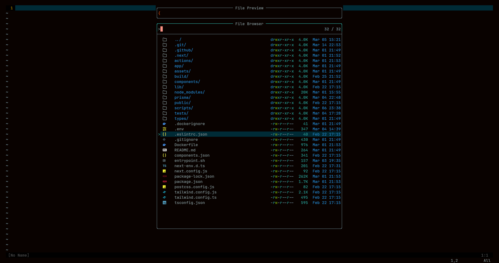

# Yozora neovim config

This neovim config is part of the Yozora project. It is a minimalistic config that is designed to be easy to understand and modify. It is also designed to be easy to use and to be a good starting point for new users.

The main repository for the Yozora project: https://github.com/joshika39/yozora

If you want to check out the other parts of the Yozora project, you can find them here: https://github.com/joshika39?tab=repositories&q=yozora

## Features

As I work as a full-stack developer, I have included complete support for JavaScript, TypeScript, Python, and Go. I have also included support for other languages, but it is not as complete.

You can work with React, Vue, and Svelte with this config. It also includes support for Django, Flask, and FastAPI.

This config uses Packer as a package manager

- LSP support
- Treesitter support
- Autocompletion
- Linting
- Formatting
- Fuzzy finding
- Git integration
- Telescope for file browsing
- Statusline
- Bufferline
- Color scheme

# Installation

## Required packages
- `pyright`
- `prettier`
- `tree-sitter`
- `ripgrep`
- `eslint`
- `eslint_d`

1. Clone the repository
```bash
git clone https://github.com/joshika39/yozora-nvim ~/.config/nvim
```

2. Install the required packages
```bash
# You can install the required packages by running the following command either with npm or your package manager of choice
npm install -g pyright prettier tree-sitter-cli eslint eslint_d
```

## Keybindings

### Normal mode

- `sf` - Telescope browse files
- `;r` - Fuzzy find in the current project
- `gd` - Go to definition
- `gr` - Find and replace references
- `K` - Show documentation
- `Ctrl + j` - Move to next lsp diagnostic
- `gD` - Find word under cursor
- `gR` - Replace start from cursor

# Show-off

### Overview


### LSP and Treesitter


### Telescope



### Git


### Statusline and Bufferline


Show some love ❤️ and support 🙌 by starring the repository.

## TODOs

- [ ] theme support
